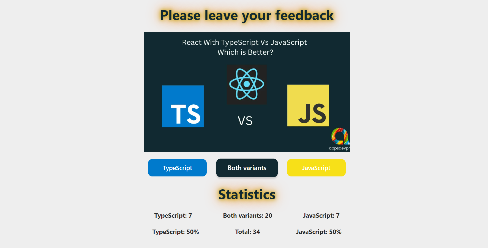

# Feedback - widget with reviews from visitors

It's an application that counts the number and percentage of reviews, on the question of what is better to write React - with Typescript or Javascript.

## Tech Stack

1. Frontend: TypeScript, React, styled-components, classes, local storage.
2. Adaptive layout for mobile, tablet and desktop.

### Local launch of the program on your device

1. Download repository and install dependencies -> npm install
2. Launch the application -> npm start.

